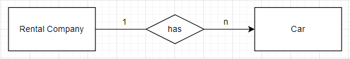
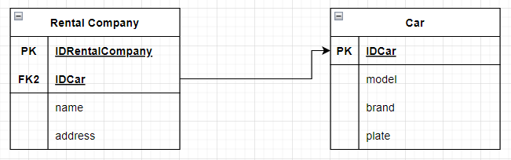
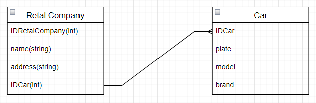
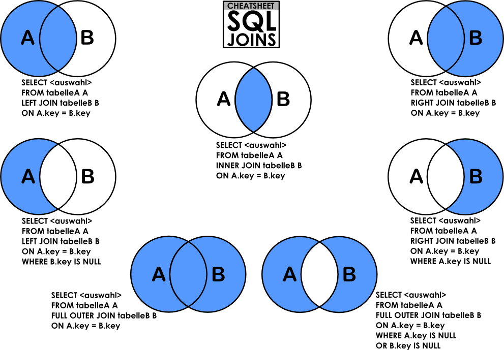

# DATA BASE
## About DB
Is usege for admnistrate informantions, is where informations are stored  
Entidades,

##Diagram(modeling)
entity, relationships, business rules, cardinalidade 1 - n

"linking two entities will always have a verb" ~filosofic

<p align="center">
  - Modelo conceitual
  
</p>

<p align="center">
  - Modelo Lógico
  
</p>

<p align="center">
  - Modelo Físico
  
</p>

#### KINDS
for each situations kinds use one this(dml,ddl...) but you can merge commands

#### syntax
| syntax | Description |
| --- | --- |
| DISTINCT | list without equality |
| NULL | without value |
| NOT NULL | with value |
| and | add more argument |
| or | conditional or one or other |
| like | 'x%'text in start '%x'text in end |
| = | exacly that |
| > | bigger |
| < | smaller |
| >= | smaller, equality |
| <= | bigger, equality |
| () | pass list or execute with priority |
| in(x,x,x) | list |
| in | inside |


##### More used / Less used
- DDL Data Definition Language
- DML Data Manipulation Language
- DQL Data Query Language
-
- DCL      Data Control Language
- DTL/TCL  Data Transaction Language/
           Transition control language
##### Commands
- ALTER TABLE
- ALTER SESSION
- ALTER TRIGGER
- ALTER USER
- ALTER VIEW
- CREATE DATABASE
- CREATE FUNCTION
- CREATE GLOBAL TEMPORARY TABLE
- CREATE INDEX
- CREATE JAVA
- CREATE PROCEDURE
- CREATE SCHEMA
- CREATE SEQUENCE
- CREATE SYNONYM
- CREATE TABLE
- CREATE TRIGGER
- CREATE USER
- CREATE VIEW
- DROP FUNCTION
- DROP INDEX
- DROP JAVA
- DROP PROCEDURE
- DROP SCHEMA
- DROP SEQUENCE
- DROP SYNONYM
- DROP TABLE
- DROP TRIGGER
- DROP USER
- DROP VIEW
- GRANT
- REVOKE
- TRUNCATE TABLE
- ALTER SEQUENCE

#### DDL
Create tables, define table obj for after you can increment in dml
| Commands | Description |
| --- | --- |
| CREATE | create a new table or database |
| ALTER | delete data from the table |
| DROP | remove table |
| RENAME | change name table |

| INTEGER | A signed integer value |
| --- | --- |
| DECIMAL(p,q) | A decimal number of p digits, of which q are decimal places |
| FLOAT(p) | A real value with precision p |
| CHARACTER(n) | A string of exactly n characters |
| BIT(n) | A string of exactly n boolean values (true/false) |
| DATE | A date, with subfields YEAR, MONTH and DAY |
| TIME | A time of day, with HOUR, MINUTE and SECOND |
| TIMESTAMP | A "time stamp" containing a specific date and time |

examples:
```sql
/*create the less influent to more influent*/
 CREATE DATABASE DBName;
 USE DBName;
 CREATE TABLE TableName1(
     IdTableName1   INT PRIMARY KEY IDNTITY,
     Name           VARCHAR(200),
     Date           DATE NOT NULL,
     CPF            CHAR(11),
     FEMALE         BIT NOT NULL
);

CRATE TABLE TableName2(
     IdTableName2 INT PRIMARY KEY IDNTITY,
     IdTableName1 INT FOREIGN KEY REFERENCES TableName1(IdTableName1),
     Name VARCHAR(200)
);
```
#### DML
Increment information
| Commands | Description |
| ---- | ---- |
| INSERT | insert a new row |
| UPDATE | update an existing row |
| DELETE | delete a row |
| TRUNCATE | remove record, logs, set values |
| MERGE | merging two rows or two tables |
- EXPLAIN PLAN | know execute process |
- subquery::=

examples:
```sql
INSERT INTO TableName (column)
VALUES ('Fisrt'),('Second');

UPDATE TableName
SET column1 = value1, column2 = value2, ...
WHERE condition;

DELETE FROM TableName WHERE condition;

MERGE DuplicateTable1 d1
USING DuplicateTable2 d2
ON (d1.id = d2.id)
WHEN MATCHED
THEN UPDATE SET 
        d1.category_name = d2.category_name,
        d1.amount = d2.amount
WHEN NOT MATCHED BY TARGET 
    THEN INSERT (category_id, category_name, amount)
         VALUES (d2.category_id, d2.category_name, d2.amount)
WHEN NOT MATCHED BY SOURCE 
    THEN DELETE;
    
ALTER TABLE Persons
DROP COLUMN DateOfBirth;
```
#### DQL
is for consult, show data
| Commands | Descriptio |
| ---- | ---- |
| SELECT | list tables, columns, values |
| INNER JOIN | list the resemblance |
| LEFT JOIN |  |
| RIGHT JOIN |  |
| FULL OUTER JOIN |  |

<p align="center">
  
</p>

examples:
```sql
/*DISTINCT for dont list duplication*/
SELECT DISTINCT * FROM TableName tn
WHERE tn.name = 'NameElementColumn'
```


#### DCL
manage security control
| Commands | Descriptio |
| ---- | ---- |
| GRANT | grant privileges |
| REVOKE | turn back privileges |

examples:
```sql

```
#### DTL/TCL
Control informations transations
| Commands | Descriptio |
| ---- | ---- |
| BEGIN TRANSACTION |  |
| COMMIT | save changes |
| SAVEPOINT | save temporarily |
| ROLLBACK | back version |
| BEGIN TRAN | start test execution |
| ROLLBACK TRAN | finish test execution |


examples:
```sql
BEGIN TRAN
/*line code*/
ROLLBACK TRAN
```

#### Cursor

<p align="center">
  
</p>

```sql
/*Query for get null values and UPDATE*/
/*open the the cursor*/
OPEN cursor1;
searchAppLayoselect * from events ev
where ev.app_layout_id is null;

select ev.id, ev.app_layout_id, ep.* from events ev
inner join event_app_layouts ep on ep.id = ev.app_layout_id
where ev.id in (
'5158e44d-8176-44dc-8740-ab0a00ee7d10',
'60468a11-2b06-470b-bca9-a9f40184b110',
'638b0f1c-3755-4303-8f9e-a95f0120664b',
'8e9b8453-7ec5-4d2e-af01-a9f40183f7d6',
'ac4ba372-39c6-467c-8c6b-aad9014cf7cb',
'be2799aa-4abc-4c89-a2ad-a9ee00037da4')

/*Other File*/
CALL eventAppLayoutsConfig();

/*Other File*/
CALL eventAppLayoutsConfig();

DELIMITER $$
DROP PROCEDURE IF EXISTS eventAppLayoutsConfig;
CREATE PROCEDURE eventAppLayoutsConfig()

BEGIN
DECLARE foundedId,newAppLayoutId CHAR(36) DEFAULT "";
DECLARE finish INTEGER DEFAULT 0; 

DECLARE cursor1 CURSOR FOR SELECT DISTINCT ev.id FROM events ev WHERE ev.app_layout_id is null; 
DECLARE CONTINUE HANDLER FOR NOT FOUND SET finish = 1; 

searchAppLayout : LOOP

    FETCH cursor1 INTO foundedId;
    IF finish = 1 THEN
        LEAVE searchAppLayout;
    END IF;

    SET newAppLayoutId = uuid();
    
    INSERT INTO event_app_layouts
    (id, 
    table_layout,
    background_image_id,
    splash_screen_image_id,
    banner_id,
    alternative_theme_color,
    favicon_image_id,
    main_image_overlay_color,
    main_image_overlay_opacity,
    title_alignment,
    logo_image_id)
    
    VALUES
    (newAppLayoutId, 1, null, null, null, '#8154A9', NULL, '#000000', '0', '2', null);
    UPDATE events SET app_layout_id = newAppLayoutId where id = foundedId;

END LOOP searchAppLayout;
CLOSE cursor1;
END$$;
DELIMITER ;

/*Query for*/
DELIMITER $$
DROP PROCEDURE IF EXISTS evmodules;
CREATE PROCEDURE evmodules()
BEGIN

DECLARE finishedEvent  INTEGER DEFAULT 0;
DECLARE generalCounter INT DEFAULT 0;
DECLARE evId char(36) DEFAULT "";

Block1: BEGIN

DECLARE curEvents 
		CURSOR FOR SELECT  DISTINCT ev.id FROM events ev inner join modules m on m.event_id = ev.id;       
        DECLARE CONTINUE HANDLER FOR NOT FOUND SET finishedEvent = 1;
        
        OPEN curEvents;        
        getEvent: LOOP        
		FETCH curEvents INTO evId; 
        IF finishedEvent = 1 THEN 
			LEAVE getEvent;
		END IF;       
		
        Block2: BEGIN       
        
        DECLARE finishedModule  INTEGER DEFAULT 0;
        DECLARE  counter INT DEFAULT 0;
        DECLARE moduleId char(36) DEFAULT "";
        DECLARE curModules CURSOR FOR SELECT m.id FROM modules m WHERE m.event_id = evId order by m.info_id;
        DECLARE CONTINUE HANDLER FOR NOT FOUND SET finishedModule = 1;
        
        SET counter:= 0;
      
        OPEN curModules;    
        
        getModule: LOOP
        FETCH curModules INTO moduleId;   
         IF finishedModule = 1 THEN 
			LEAVE getModule;
		END IF;
        
        UPDATE `selected_modules` 
        SET module_id = moduleId, position = counter;
        
        SELECT CONCAT("contador: ",counter, " contador geral: ", generalCounter);
              SET counter = counter + 1;
              SET generalCounter = generalCounter + 1; 
              
        	END LOOP getModule;          
            CLOSE curModules;             
     
        END Block2;     
        
        
	END LOOP getEvent;
            
		CLOSE curEvents;
        
        END Block1;             
END$$;
DELIMITER ;

/*Query for*/
DELIMITER $$
DROP PROCEDURE IF EXISTS appLayoutConfig;
CREATE PROCEDURE appLayoutConfig()
BEGIN

DECLARE finishedSelectedModules INTEGER DEFAULT 0;
DECLARE appLayoutId, moduleInfoId char(36) DEFAULT "";

Block1: BEGIN

DECLARE curSelectedModules CURSOR FOR SELECT DISTINCT sm.app_layout_id, sm.module_info_id FROM selected_modules sm;
DECLARE CONTINUE HANDLER FOR NOT FOUND SET finishedSelectedModules = 1;

OPEN curSelectedModules;
getSelectedModules: LOOP
FETCH curSelectedModules INTO appLayoutId, moduleInfoId;
IF finishedSelectedModules = 1 THEN 
			LEAVE getSelectedModules;
		END IF;  

 Block2: BEGIN

DECLARE finishedModule  INTEGER DEFAULT 0;
DECLARE moduleId char(36) DEFAULT "";
DECLARE notUsedPosition int(11) DEFAULT 0;
DECLARE  counter INT DEFAULT 0;

DECLARE curModules CURSOR FOR SELECT DISTINCT m.id, sm2.position  FROM modules m 
inner join events ev on ev.id = m.event_id
inner join selected_modules sm2 on sm2.app_layout_id = ev.app_layout_id and sm2.module_info_id = m.info_id
WHERE ev.app_layout_id = appLayoutId 
ORDER BY sm2.position ASC;

 DECLARE CONTINUE HANDLER FOR NOT FOUND SET finishedModule = 1;
 
 OPEN curModules;
 
 getModules: LOOP
 FETCH curModules INTO moduleId, notUsedPosition;
 IF finishedModule = 1 THEN 
			LEAVE getModules;
		END IF;
        
        INSERT INTO selected_modules (app_layout_id, module_info_id,position, module_id) VALUES(appLayoutId,moduleInfoId, counter,moduleId );
        SET counter = counter + 1;
 
 END LOOP getModules;          
CLOSE curModules; 

  END Block2; 
END LOOP getSelectedModules;
            
		CLOSE curSelectedModules;
END Block1;
END$$;
DELIMITER ;
```

Contents
<br /> 
https://docs.oracle.com/cd/B14156_01/doc/B13812/html/sqcmd.htm
<br /> 
https://www.w3schools.com/sql/sql_delete.asp
<br /> 
https://www.dirceuresende.com/blog/sql-server-como-utilizar-o-comando-merge-para-inserir-atualizar-e-apagar-dados-com-apenas-1-comando/
